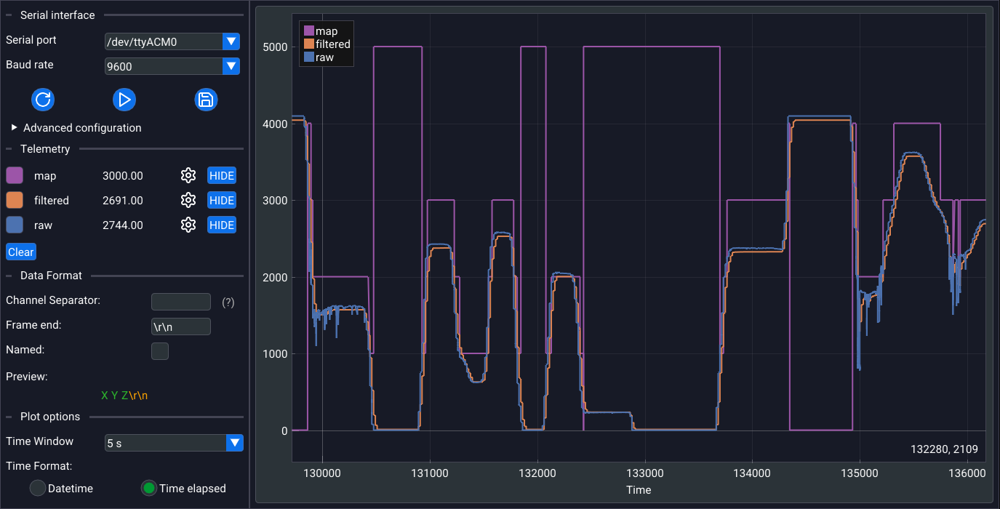

# Better Serial Plotter



**Better Serial Plotter** is a fast and lightweight serial plotter useful for reading serial data from microcontroller or other devices.

## Install Conan dependencies

```bash
CC=clang CXX=clang++ PKG_CONFIG_PATH=/usr/lib/pkgconfig conan install . --output-folder=build --build=missing -s build_type=<Debug|Release>
```

## TODO

- [ ] Binary formatting
- [ ] UDP support
- [ ] serial monitor + serial writing
