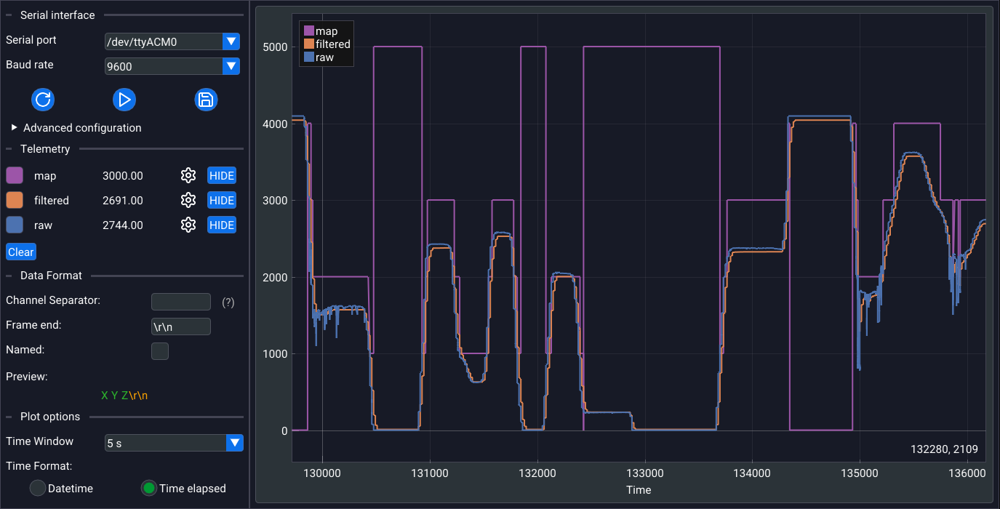

# LambdaPlotter

[](https://github.com/ender878/LambdaPlotter/actions/workflows/build_and_test.yml)
[](LICENSE)
[](CMakeLists.txt)



**LambdaPlotter** is a fast and lightweight serial plotter useful for reading and plotting any type of serial data in real time.

## Features

* **Lightweight and Fast:** Built with modern C++ for high performance and low resource usage.
* **Advanced Serial Configuration:** Configure low-level serial port settings, like *parity*, *stop bits* and more.
* **Channel-based plotting:** Plot multiple variables at the same time. Each one of these is treated as a different *channel*, which can be further configured (e.g. offsets, scaling and more)
* **Custom Data Formatting:** Specify the format of the data that the plotter receives. This allows the plotter to correctly parse the data and be adaptable to any type of data stream.
* **Plot Customization:** Customize the style of the plot: time windows, colors and more.
* **Saving the data:** Save the visualized plot into a **.csv** file.
* **User-Friendly Interface:** Powered by the excellent [Dear ImGui](https://github.com/ocornut/imgui) and [ImPlot](https://github.com/epezent/implot) libraries.

## Compile frome source

### Prerequisites

To compile this project from source, make sure you have a compiler that supports **C++20** (for better compatibility, I highly suggest using **clang** or **MSVC**, for Windows) and have **Python** and **CMake** installed.

### Install conan

This project uses **conan** as the package manager for managing all the major dependencies. You can install it using **pip**:

```bash
pip install conan
```

### Clone the repository

```bash
git clone https://github.com/ender878/lambda_plotter.git
cd lambda_plotter
```

### Install conan dependencies

Once inside the project's folder, install all the dependencies using conan:

```bash
CC=clang CXX=clang++ conan install . --build=missing -s build_type=<Release|Debug>
```

> [!NOTE]
> Specify the compiler to make sure that conan uses the correct one to build dependencies

Conan will install all the dependencies specified inside `conanfile.txt`.

### Build with CMake

Once all the dependencies are installed, we can finally build the project:

```bash
cmake --preset <conan-debug|conan-release> -DCMAKE_C_COMPILER=clang -DCMAKE_CXX_COMPILER=clang++

cmake --build build/<Release|Debug>
```

> [!NOTE]
> On Windows MSVC builds, you may have to specify `conan-default` as the preset.

Once compiled, the executable will be inside `build/Release` or `build/Debug`, depending on what you choose.

## Contributing

Contributions are welcome! Please feel free to submit a pull request or open an issue for bugs, feature requests, or suggestions.

## Roadmap

Here are some of the planned features:

* [ ] Binary data formatting
* [ ] UDP support
* [ ] Integrated serial monitor
